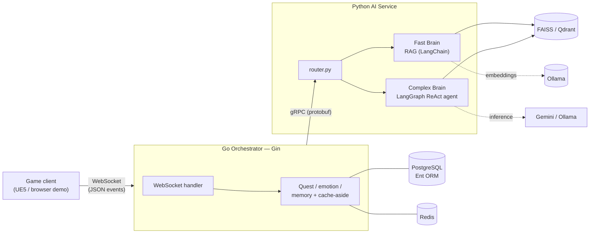

# Agentic NPC Framework: A High-Performance Distributed System for Generative Game AI

[](https://github.com/Kprateek283/agentic-npc-project/actions/workflows/ci.yml)

This repository contains a modular, production-grade backend framework designed to power autonomous, stateful, and memory-aware Non-Player Characters (NPCs) in modern game environments like Unreal Engine 5. The system moves beyond traditional deterministic behavior trees by leveraging Large Language Models (LLMs) for dynamic dialogue, emotional evolution, and complex quest reasoning.

## Core Philosophy: The Two-Brain Model

To balance the competing requirements of real-time responsiveness and cognitive depth, the architecture implements a novel Two-Brain model:

1. Fast Brain (Retrieval-Augmented Generation): A path for factual queries and lore-related interactions. It utilizes a FAISS-based vector store to ground LLM responses in game-specific context. Measured cloud RAG latency is ~2.9 s and is inference-dominated — the orchestration wrapped around it is sub-10 ms (see [Benchmarks](#performance-benchmarks-measured)).
2. Complex Brain (Stateful Reasoning): A high-depth path for state-changing events and quest progression. Built on LangGraph, this "brain" runs a real multi-step ReAct loop (tool calls + iteration cap), updates internal emotional states, and handles complex transitions in game logic, with a focus on narrative consistency (measured latency ~5.4 s cloud / ~26 s local — see [Benchmarks](#performance-benchmarks-measured)).

## Quickstart

Requires Docker and a host [Ollama](https://ollama.com) (used for embeddings in **both**
provider modes).

```bash
# 1. Host Ollama — bound to 0.0.0.0 so the containers can reach it via the host gateway
OLLAMA_HOST=0.0.0.0:11434 ollama serve &     # or a systemd override (see .env.example)
ollama pull nomic-embed-text                  # embeddings — required in both modes
ollama pull llama3.1:8b                        # local chat model — only for LLM_PROVIDER=ollama

# 2. Configure and boot the whole stack (Postgres, Redis, Qdrant, Go orchestrator, Python AI)
cp .env.example .env                           # set POSTGRES_PASSWORD; pick LLM_PROVIDER
docker compose up --build

# 3. Talk to an NPC
#    Open client-demo/index.html in a browser → Register → pick Elara → ask a question.
```

The browser [reference client](client-demo/) speaks the documented
[WebSocket protocol](docs/client_protocol.md) end to end (authenticate → converse → quest
events). To run the services directly without Docker, see the per-service `.env.example`
files. Provider, models, vector store, and ports are all env-driven — see
[Configuration](#inference-provider-configuration).

## Architectural Overview

The framework is built as a decoupled microservice architecture, leveraging the strengths of Go for high-concurrency orchestration and Python for advanced AI/ML workflows.



### 1. Go Orchestrator (The Dungeon Master)
The Go service acts as the authoritative source of truth and the central hub for the game world.
- Connection Management: Handles persistent, bidirectional communication with game clients via WebSockets (Gin).
- State Machine: Manages quest lifecycles, player inventories, and NPC relationships.
- Orchestration: Routes player events to the appropriate AI brain via high-performance gRPC calls.
- Persistence Layer: Utilizes the Ent ORM for type-safe, graph-based interactions with PostgreSQL.
- Caching: Implements a cache-aside strategy with Redis to minimize database I/O for frequently accessed player and NPC states (e.g., trust levels, active session data).

### 2. Python AI Service (The Brain)
The Python service encapsulates all LLM logic and cognitive processes.
- gRPC Interface: Exposes specialized methods for RAG-based retrieval and LangGraph-driven reasoning.
- REST Interface (FastAPI): A second transport over the same agents, for evals, benchmarks, healthchecks and demos.
- LangChain Integration: Orchestrates model prompts, output parsers, and tool-calling chains.
- Vector Store (pluggable): FAISS or Qdrant, selected by env var, for similarity search over NPC lore.
- Dynamic Context Injection: Formats real-time game state (emotions, memories, quest progress) into the LLM context window to ensure situational awareness.

## Technical Specifications

### Tech Stack
- Backend: Go (Golang), Gin, Ent ORM, gRPC-Go, Go-Redis.
- AI Service: Python, LangChain, LangGraph, FAISS, gRPC-Python.
- Data Management: PostgreSQL, Redis.
- Inference: Google Gemini API (Cloud) and Ollama/Llama 3.1 (Local).
- Infrastructure: Docker, Docker Compose, Protocol Buffers.
- Client Target: designed for Unreal Engine 5 (C++/Blueprints); a dependency-free browser [reference client](client-demo/) ships in the repo and implements the same protocol.

### Communication Protocols
- Client-to-Backend: JSON-based events over persistent WebSockets — full contract in [`docs/client_protocol.md`](docs/client_protocol.md).
- Inter-Service: Binary Protocol Buffers over gRPC (HTTP/2), ensuring low-latency and strict type safety between the Go and Python layers.

### Service Transports

The AI service runs two transports in one process, sharing a single in-memory agent
registry. Both dispatch through the same routing function (`router.py`), so REST and gRPC
cannot drift apart.

| Transport | Port | Who uses it |
|---|---|---|
| gRPC (`AIBrain.Think`) | `50051` | The Go orchestrator — the production path |
| REST (FastAPI) | `API_PORT`, default `8000` | Evals, benchmarks, container healthchecks, demos |

| REST endpoint | Purpose |
|---|---|
| `GET /health` | Status, agent count, active provider and models |
| `GET /v1/npcs` | Loaded agents (key, name, occupation) |
| `POST /v1/chat` | Ask an NPC a lore question (RAG path) |
| `POST /v1/event` | Send a game event (LangGraph path) |

Errors: unknown NPC → `404`, unknown/invalid event → `422`, provider failure → `502`.
The Go orchestrator's HTTP/WebSocket port is `SERVER_PORT` (default `8080`).

```bash
curl localhost:8000/health
curl -X POST localhost:8000/v1/chat -H 'Content-Type: application/json' \
  -d '{"npc":"elara","question":"Who is the mayor?"}'
```

### Inference Provider Configuration

The chat provider is selected at startup by environment variable — no code changes. See
`ai-service-python/.env.example` for the full set of variables and their defaults.

| Variable | Default | Purpose |
|---|---|---|
| `LLM_PROVIDER` | `gemini` | `gemini` (cloud) or `ollama` (local) |
| `GEMINI_API_KEY` | — | Required only when `LLM_PROVIDER=gemini` |
| `GEMINI_MODEL` | `gemini-3.5-flash` | Cloud chat model (pinned; 2.5-flash is closed to new GCP projects) |
| `OLLAMA_MODEL_HEAVY` | `llama3.1:8b` | Local chat model for the LangGraph agent (needs tool-calling) |
| `OLLAMA_MODEL_LIGHT` | = `OLLAMA_MODEL_HEAVY` | Local chat model for the RAG path |
| `EMBEDDING_MODEL` | `nomic-embed-text` | Embedding model (always local via Ollama) |
| `OLLAMA_HOST` | `http://localhost:11434` | Ollama endpoint |
| `VECTOR_STORE` | `faiss` | `faiss` (in-process) or `qdrant` (scale-out) |
| `QDRANT_URL` | `http://localhost:6333` | Qdrant endpoint, used when `VECTOR_STORE=qdrant` |
| `RETRIEVER_K` | `3` | Lore documents retrieved per query |

Embeddings always run locally on Ollama regardless of the chat provider, so Ollama is a
dependency in both modes:

```bash
# Install Ollama (https://ollama.com/download), then:
ollama pull nomic-embed-text   # embeddings — required in both modes
ollama pull llama3.1:8b        # chat — only needed for LLM_PROVIDER=ollama
```

```bash
# Cloud mode (default)
LLM_PROVIDER=gemini
GEMINI_API_KEY=your-key-here

# Local mode — no API key needed
LLM_PROVIDER=ollama
OLLAMA_MODEL_HEAVY=llama3.1:8b
```

### Vector Store

**FAISS is the default** — in-process, zero infrastructure, rebuilt from `lore.json` at
startup. **Qdrant is the scale-out path**: a real vector database that survives restarts
and can be shared by multiple AI-service replicas. It stores one collection per NPC
(`lore_elara`, `lore_baelor`, …), and the embedding dimension is taken from the embedding
model rather than hardcoded.

```bash
docker compose up -d qdrant           # start it first
VECTOR_STORE=qdrant                   # then select it
```

If `VECTOR_STORE=qdrant` and Qdrant is unreachable, the service **fails at startup** with a
clear error rather than falling back to FAISS — a silent fallback would make benchmark and
eval results lie about which backend produced them.

### Performance Benchmarks (measured)

Every figure below comes from a committed, re-runnable script — see
[`docs/benchmarks.md`](docs/benchmarks.md) for methodology, hardware and full tables.

| Path | Median | What it measures |
|---|---|---|
| gRPC round-trip (no LLM) | **0.14 ms** | protobuf + HTTP/2 + routing, no inference |
| End-to-end infra (WebSocket → Go → gRPC → Python) | **7.37 ms** | full orchestration, no inference |
| Cache hit (Redis + Postgres PK) vs miss (Postgres lookup) | **0.15 / 0.20 ms** | cache-aside read path |
| Fast brain — RAG (cloud, gemini-3.5-flash) | **~2.9 s** | inference-dominated (n=3, free-tier cap) |

**Headline:** infrastructure is sub-10 ms; inference is seconds. The Go/gRPC/Redis
orchestration is ~0.2% of a cloud RAG turn — **latency is inference-dominated, not an
infrastructure bottleneck.** (Earlier README figures of ~14 ms gRPC and ~8/42 ms cache were
never measured; the real values above are 50–200× lower.)

### Evaluation (RAG quality)

A 50-question harness (`python -m evals.run` from `ai-service-python/`) scores retrieval and
grounding over all 8 NPCs (40 in-scope, 10 out-of-scope traps). Full methodology, judge
caveats and raw result files: [`evals/results.md`](ai-service-python/evals/results.md).
Headline — **llama3.1:8b** answering, **independently judged by qwen2.5:14b** (to avoid
self-preference bias):

| Metric | Value |
|---|---|
| hit@1 / hit@3 (retrieval, deterministic substring match) | **92.5% / 97.5%** |
| grounded-correct (in-scope, n=40) | **95.0%** |
| hallucinated (in-scope) | **0.0%** |
| refusal rate (out-of-scope, n=10) | **90.0%** |

Retrieval metrics are deterministic and fully trustworthy; grounding/refusal depend on the
named LLM judge. `results.md` documents a known judge limitation (incidental persona
contradictions are under-detected) rather than papering over it — so "0% in-scope
hallucination" means *of the answer to the question asked*.

## Testing

Both suites run with no external services and no API keys — LLM and embedding calls are
faked, so nothing hits Ollama, Gemini, Postgres or Redis.

```bash
# Python (from ai-service-python/): router dispatch, context formatter, prompt loader, retriever
pip install -r requirements.txt -r requirements-dev.txt
PYTHONPATH=. python -m pytest tests/ -q

# Go (from backend-go/): emotion deltas, quest preconditions, item lookup, DTO round-trip
go test ./...
```

## Data Persistence & Schema Design

The system employs an 8-table relational schema designed for extensibility:
- Player & NPC Entities: Core state and identity.
- Relationships: Tracks dynamic variables like trust_level and emotional affinity.
- NPC_Memory: Stores persistent key-value memories for long-term NPC continuity.
- Quest & Inventory: Manages player progression and item-based triggers.

## Deployment & Scaling

The framework is designed for horizontal scalability:
- Stateless Orchestration: The Go service can be scaled behind a load balancer with Redis handling session state.
- GPU-Aware AI Routing: The Python service is structured to support multi-instance deployment on GPU-accelerated nodes for local inference or high-throughput cloud API routing.
- Containerization: Full Docker Compose support for standardized development and production environments.

## Future Vision

Planned enhancements focused on production-scale deployment include:
- Persistent Writable RAG: Enabling NPCs to dynamically update their own vector stores with new player-specific memories.
- Proactive NPCs: State-driven triggers that allow NPCs to initiate conversations or world actions without player input.
- Hardware-Aware Routing: Intelligent load balancing that toggles between local and cloud inference based on real-time latency and cost constraints.

---
This project was developed as a comprehensive exploration of distributed systems, real-time state management, and the integration of generative AI into high-performance gaming backends.
