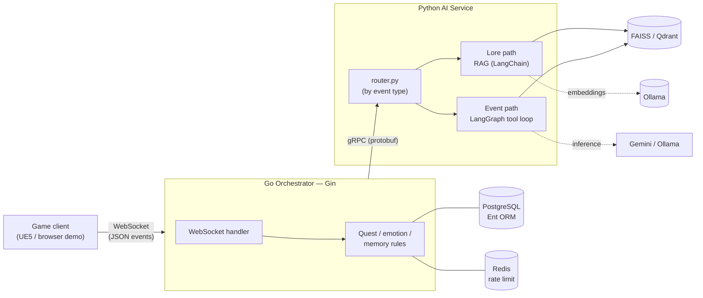

# Agentic NPC Backend

[](https://github.com/Kprateek283/agentic-npc-project/actions/workflows/ci.yml)

A Go + Python backend for game NPCs that talk with an LLM while their game state stays
deterministic. A Go orchestrator owns the world — quests, trust, emotions, memories — and
changes it with plain rules loaded from JSON. A Python AI service turns that state into
in-character dialogue, grounded in each NPC's own lore. The target client is Unreal Engine 5;
this repo ships a browser reference client that speaks the same protocol.

## How it works: rules change state, the model narrates

Every player event goes to the Go orchestrator first. It checks quest triggers and
preconditions, applies rewards, adjusts the NPC's emotions by fixed per-event amounts, and
records a memory — all before any model is called. Only then does it send the current state
to the Python AI service over gRPC. The model never changes game state; it only speaks.

The AI service picks one of two paths by **event type** (`router.py`):

1. **Lore path (RAG):** a player question retrieves the most relevant facts from that NPC's
   lore (FAISS or Qdrant) and answers from them, with grounding rules that make the NPC admit
   ignorance instead of inventing names. Answers stream token by token.
2. **Event path (LangGraph):** state events such as gifts, quest items and attacks run a
   tool-calling loop (capped by `AGENT_MAX_ITERATIONS`, default 5) with two read-only tools,
   lore search and quest status, and produce the NPC's reaction.

Unknown event types skip the LLM entirely and get a fixed line.

## Quickstart

Requires Docker and a host [Ollama](https://ollama.com) (used for embeddings in **both**
provider modes). If Ollama is not reachable when the AI service starts, the service exits and
compose restarts it until Ollama is up.

```bash
# 1. Host Ollama — bound to 0.0.0.0 so the containers can reach it via the host gateway
OLLAMA_HOST=0.0.0.0:11434 ollama serve &     # or a systemd override (see .env.example)
ollama pull nomic-embed-text                  # embeddings — required in both modes
ollama pull llama3.1:8b                        # local chat model — only for LLM_PROVIDER=ollama

# 2. Configure and boot the whole stack (Postgres, Redis, Qdrant, Go orchestrator, Python AI)
cp .env.example .env                           # set POSTGRES_PASSWORD; pick LLM_PROVIDER
docker compose up --build

# 3. Talk to an NPC
#    Open client-demo/index.html in a browser → Register → pick Elara → ask a question.
```

The browser [reference client](client-demo/) speaks the documented
[WebSocket protocol](docs/client_protocol.md) end to end (authenticate → converse → quest
events). To run the services without Docker, see the per-service `.env.example` files.

## Architecture



### Go orchestrator (`backend-go/`)

- **WebSocket sessions** with login/registration (bcrypt); allowed browser origins come from
  `ALLOWED_ORIGINS`, and clients without an `Origin` header (game engines) are accepted.
- **Quest engine:** triggers, trust/quest preconditions and rewards defined in
  `gamedata/quests/`. Question triggers match the keyword as a whole word.
- **NPC state:** every event is remembered as an "episode" (`gamedata/events.json` defines its
  emotion deltas and intensity); feelings toward a player and the NPC's general mood are computed
  from those memories rather than stored.
- **Rate limiting:** a per-player fixed-window limit on AI calls, kept in Redis
  (`LLM_RATE_LIMIT` per `LLM_RATE_WINDOW_SECONDS`, default 20 per 60 s), protects the shared
  LLM quota; if Redis is unreachable the check fails open.
- **Resilience:** per-call gRPC deadline (`AI_CALL_TIMEOUT`, default 40 s) and an in-character
  fallback line instead of an error when the AI service fails. When a player disconnects
  mid-answer, the in-flight gRPC call is cancelled; for streamed lore answers the cancellation
  reaches the model, which stops generating.
- **Admin commands** (`ADMIN_SET_TRUST`, `ADMIN_SET_QUEST_STAGE`) are off unless
  `ADMIN_ENABLED=true`.

### Python AI service (`ai-service-python/`)

- **Two transports, one router:** gRPC for the Go orchestrator and REST (FastAPI) for evals,
  benchmarks, health checks and demos, both dispatching through `router.py`.
- **One agent per NPC**, keyed by NPC name, built at startup from `gamedata/npcs/`
  (personality, backstory, lore).
- **Semantic response cache** for repeated lore questions (cosine match on the question
  embedding, threshold 0.90). It only serves anonymous, memory-free requests — REST, evals and
  benchmarks. In-game requests always carry a speaker and bypass it, so one player's answer is
  never replayed to another.
- **Health:** `/health` returns 503 while no agents are loaded.
- **Optional LangSmith tracing**, off by default — see [`docs/langsmith.md`](docs/langsmith.md).

## Service transports

| Transport | Port | Who uses it |
|---|---|---|
| gRPC (`AIBrain.Think`, `ThinkStream`) | `50051` | The Go orchestrator |
| REST (FastAPI) | `API_PORT`, default `8000` | Evals, benchmarks, container health checks, demos |

| REST endpoint | Purpose |
|---|---|
| `GET /health` | Status, agent count, active provider and models (503 with no agents) |
| `GET /v1/npcs` | Loaded agents (key, name, occupation) |
| `POST /v1/chat` | Ask an NPC a lore question (RAG path) |
| `POST /v1/event` | Send a game event (LangGraph path) |

Errors: unknown NPC → `404`, unknown/invalid event → `422`, provider failure → `502`.
The Go orchestrator's HTTP/WebSocket port is `SERVER_PORT` (default `8080`).

```bash
curl localhost:8000/health
curl -X POST localhost:8000/v1/chat -H 'Content-Type: application/json' \
  -d '{"npc":"elara","question":"Who is the mayor?"}'
```

## Configuration

Everything is env-driven; each service's `.env.example` lists every variable with its default.

**AI service**

| Variable | Default | Purpose |
|---|---|---|
| `LLM_PROVIDER` | `gemini` | `gemini` (cloud) or `ollama` (local) |
| `GEMINI_API_KEY` | — | Required only when `LLM_PROVIDER=gemini` |
| `GEMINI_MODEL` | `gemini-3.5-flash` | Cloud chat model (pinned; 2.5-flash is closed to new GCP projects) |
| `OLLAMA_MODEL_HEAVY` | `llama3.1:8b` | Local chat model for the LangGraph agent (needs tool-calling) |
| `OLLAMA_MODEL_LIGHT` | = `OLLAMA_MODEL_HEAVY` | Local chat model for the RAG path |
| `EMBEDDING_MODEL` | `nomic-embed-text` | Embedding model (always local via Ollama) |
| `OLLAMA_HOST` | `http://localhost:11434` | Ollama endpoint |
| `VECTOR_STORE` | `faiss` | `faiss` (in-process) or `qdrant` (scale-out) |
| `RETRIEVER_K` | `3` | Lore documents retrieved per query |
| `GAMEDATA_DIR` | `../gamedata` | Shared game data (`/app/gamedata` in the image) |

**Go orchestrator**

| Variable | Default | Purpose |
|---|---|---|
| `POSTGRES_DSN` | — | Required |
| `REDIS_ADDR` | `localhost:6379` | Redis for the rate limiter |
| `AI_SERVICE_ADDR` | `localhost:50051` | AI service gRPC address |
| `GAMEDATA_DIR` | `../gamedata` | Shared game data (`/app/gamedata` in the image) |
| `ALLOWED_ORIGINS` | empty (same-origin only) | Comma-separated browser origins; compose defaults to `null` for the double-clicked demo |
| `ADMIN_ENABLED` | `false` | Enables the admin WebSocket events |
| `LLM_RATE_LIMIT` / `LLM_RATE_WINDOW_SECONDS` | `20` / `60` | Per-player AI calls per window; `0` disables |
| `AI_CALL_TIMEOUT` | `40` | Per-call gRPC deadline in seconds |

### Vector store

**FAISS is the default** — in-process, zero infrastructure, rebuilt from `lore.json` at
startup. **Qdrant is the scale-out path**: a real vector database that survives restarts and
can be shared by multiple AI-service replicas. It stores one collection per NPC
(`lore_elara`, `lore_baelor`, …), and the embedding dimension is taken from the embedding
model rather than hardcoded.

```bash
docker compose up -d qdrant           # start it first
VECTOR_STORE=qdrant                   # then select it
```

If `VECTOR_STORE=qdrant` and Qdrant is unreachable, the service **fails at startup** with a
clear error rather than falling back to FAISS — a silent fallback would make benchmark and
eval results lie about which backend produced them.

## Performance (measured)

Every figure comes from a committed, re-runnable script — see
[`docs/benchmarks.md`](docs/benchmarks.md) for methodology, hardware and full tables. Cloud
sample sizes are small because of the Gemini free-tier quota; they are indicative, not robust.

| Path | Median | Sample | What it measures |
|---|---|---|---|
| gRPC round trip (no LLM) | **0.14 ms** | n=200 | protobuf + HTTP/2 + routing |
| End-to-end infra (WebSocket → Go → gRPC → Python) | **7.37 ms** | n=100 | full orchestration, no inference |
| Lore path, cloud (gemini-3.5-flash) | **2.87 s** | n=3 | full answer |
| Lore path, local (llama3.1:8b) | **18.2 s** | n=30 | full answer |
| Event path, cloud | **5.43 s** | n=1 | full agent run |
| Event path, local | **26.0 s** | n=15 | full agent run |

**Headline:** orchestration is sub-10 ms; inference is seconds. The Go/gRPC layer is about
0.2% of a cloud lore answer — latency is inference-dominated, not an infrastructure
bottleneck. (Earlier README figures of ~14 ms gRPC were never measured; the real value is
about 100× lower.)

## Evaluation (lore answer quality)

A 50-question harness (`python -m evals.run` from `ai-service-python/`) scores retrieval and
grounding over all 8 NPCs (40 in-scope, 10 out-of-scope traps). Full methodology, judge
caveats and raw result files: [`evals/results.md`](ai-service-python/evals/results.md).
Headline — **llama3.1:8b** answering, **independently judged by qwen2.5:14b** (to avoid
self-preference bias):

| Metric | Value |
|---|---|
| hit@1 / hit@3 (retrieval, deterministic substring match) | **92.5% / 97.5%** |
| grounded-correct (in-scope, n=40) | **95.0%** |
| hallucinated (in-scope) | **0.0%** |
| refusal rate (out-of-scope, n=10) | **90.0%** |

Retrieval metrics are deterministic; grounding and refusal depend on the named LLM judge.
`results.md` documents a known judge limitation (incidental persona contradictions are
under-detected), so "0% in-scope hallucination" means *of the answer to the question asked*.

## Testing

Both suites run with no external services and no API keys: LLM and embedding calls are faked,
and the Go quest tests use an in-memory SQLite database.

```bash
# Python (from ai-service-python/): router, agent lookup, context formatting, prompt loading,
# retrieval, streaming cancellation, health endpoint.
# Python is pinned to 3.12 in .python-version; uv fetches it if your system has another version.
uv venv && uv pip install -r requirements.txt -r requirements-dev.txt
PYTHONPATH=. .venv/bin/python -m pytest tests/ -q

# Go (from backend-go/): quest pipeline (SQLite), keyword matching, trust preconditions,
# emotion deltas, origin checks, admin gate, DTO round trip.
go test ./...
REDIS_ADDR=localhost:6379 go test ./internal/ratelimit/   # optional: rate limiter against a real Redis
```

## Data model

Eight PostgreSQL tables via Ent: `players`, `npcs` (identity plus one emotion state per NPC),
`quests` and `player_quest_states` (progress per player), `player_npc_relationships` (trust
level and gift count), `memories` (an event log: event type, participants, description),
`items`, and `inventory_items` (in the schema, not yet used by game logic).

## Known limitations

These are real gaps in the current design, kept here rather than hidden:

- **Emotions are shared and never fade.** Each NPC has one emotion state for all players, and
  nothing decays it, so one player's attack makes the NPC angry at everyone indefinitely.
- **Attacks don't lower the trust the model sees.** The model gets per-player relationship
  trust, which only gifts, quest rewards and admin commands change.
- **Memory records event types, not conversations.** A memory is "player1 triggered
  PLAYER_ASKED_QUESTION on Elara"; the question and answer are not stored, and only the last
  five memories reach the prompt.
- **The model can only speak.** Every reply is `SPEAK`; it cannot act on the world.
- **Event-path runs are not interrupted by a disconnect.** The LangGraph agent runs as one
  blocking call, so it finishes even if the player has left; only lore answers stop early.
- **The semantic cache rarely helps in play**, since in-game requests always carry a speaker.

A redesign of memory and emotions is planned: per-player and general memories with
intensity-based lifespans, emotions computed from those memories, escalation on repeated
offences, and forgiveness that changes the feeling but not the fact.
