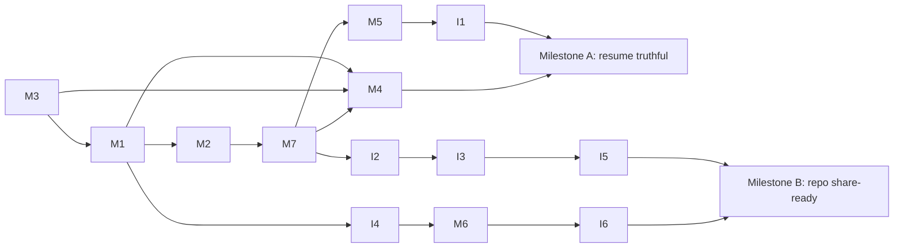

# Implementation Order

Execution sequence for the items in `resume_alignment_checklist.md`, with plans in
`implementation_plan.md`. Ordering principle: **plumbing → truth → proof → polish →
differentiators**. Items that produce resume numbers (evals, benchmarks) come only after
the things they measure are real; repo-facing polish comes only after the content it
presents exists.

## Phase 0 — Foundation plumbing (everything depends on this)

| # | Item | Why first |
|---|------|-----------|
| 1 | **M3** Provider switch (Gemini/Ollama via env) | `config.py` is imported by every module; touching it later means re-testing everything. Benchmarks (M4) are impossible without the local path. |
| 2 | **M1** FastAPI layer + shared router extraction | The REST surface is the entry point evals (I1) and benchmarks (M4) drive. The router extraction also creates the seam that Python tests (I2) hook into. |
| 3 | **M2** Pluggable vector store (FAISS/Qdrant) + configurable `k` | Retriever `k=3` is a prerequisite for hit@3 scoring in I1. Doing this after evals would invalidate eval results. |

## Phase 1 — Make the claims true (before measuring anything)

| # | Item | Why here |
|---|------|----------|
| 4 | **M7** Real multi-step LangGraph agent with tool execution | The agent must genuinely be multi-step *before* benchmarks time it and evals score it — otherwise every number measured in Phase 2 is thrown away when the graph changes. |
| 5 | **M5** Grounding: consolidated RAG prompt, refusal instruction, wire `dynamic_context` into the RAG chain | Same logic: prompt and context changes alter answers, so they must land before eval numbers are recorded. |

## Phase 2 — Produce the resume numbers

| # | Item | Why here |
|---|------|----------|
| 6 | **I1** 50-question eval harness (hit@1/@3, LLM-as-judge, refusal rate) | Measures the Phase 1 system. Unlocks the commented-out resume bullet and verifies M5's refusal behavior. |
| 7 | **M4** Benchmark scripts + `docs/benchmarks.md` | Needs M1 (REST endpoints to drive), M3 (both providers), M7 (the real agent path). Produces/replaces every latency and 2.3x figure on the resume and README. |

**Milestone A — resume is truthful.** After this phase, update the resume with measured
numbers and the M6 rewording. It can go out now; everything after strengthens it.

## Phase 3 — Engineering hygiene (JD mandatory: testing, CI, Docker)

| # | Item | Why here |
|---|------|----------|
| 8 | **I2** Test suites (pytest + Go table tests) | Tests target the post-refactor code (router seam from M1, real graph from M7) — writing them earlier means rewriting them. |
| 9 | **I3** GitHub Actions CI | Needs tests to run. Trivial once I2 exists. |
| 10 | **I4** Dockerfiles + full compose bring-up | Needs the env-driven config from M1–M3 (container networking requires no hardcoded hosts) and the `/health` endpoint from M1 for healthchecks. |

## Phase 4 — Public face (do before sharing the repo link anywhere)

| # | Item | Why here |
|---|------|----------|
| 11 | **I5** Repo hygiene: delete interview docs, env-var secrets, drop `vendor/`, track the architecture doc | Must precede any recruiter seeing the repo. Done after I3 so the vendor removal is validated by green CI. |
| 12 | **M6** Protocol doc + browser reference client + README/resume rewording | The client is the demo artifact; it needs the full stack runnable (I4) to record against. |
| 13 | **I6** README rewrite (quickstart, mermaid diagram, benchmark + eval tables, badge) | Last of the mandatory/immediate set because it *presents* everything above; writing it earlier means rewriting it. |

**Milestone B — repo is share-ready.** Resume link can go live.

## Phase 5 — High-signal extras (in value-per-effort order)

| # | Item | Notes |
|---|------|-------|
| 14 | **C1** Structured logging + built-in latency attribution | Makes M4's numbers continuously observable; great interview story. |
| 15 | **C2** gRPC resilience (deadlines, retry, in-character fallback) | Small, cheap, hits JD "reliability". |
| 16 | **C5** LangSmith tracing + screenshots | Near-zero effort (dependency already installed); needs M7's loop to be worth screenshotting. |
| 17 | **C3** Token streaming (proto change, partial/final WebSocket messages) | Biggest UX win; adds a TTFT resume metric; update reference client + re-record demo GIF after. |
| 18 | **C4** Semantic response cache | Depends on M5's context injection decision (cache key vs emotions); yields a cost/latency metric. |

## Phase 6 — Differentiators (pick by available time, any order)

- **S1** Writable RAG / episodic player memories — strongest resume bullet of the stretch set; needs M2 (Qdrant).
- **S2** AWS EC2 deployment with public demo URL — backs the EC2 skills claim; needs I4.
- **S5** Load test with stub-LLM mode — cheap after I4; produces a concurrency metric.
- **S3** LoRA persona fine-tune — highest effort, rarest signal; needs M3 (Ollama serving) and I1 (judge rubric to score it).
- **S4** NPC↔NPC multi-agent — do only after S1 (memories make it meaningful).

## Anytime / trailing

- **N1** Demo GIF — record once M6 client exists; re-record after C3.
- **N4** Cost analysis — 30 minutes once M4 data exists.
- **N5** Pre-commit hooks — anytime after I3.
- **N2** Knowledge-graph experiment, **N3** blog post — last; timeboxed.

## Dependency summary

**Rules of thumb**
- Never record an eval/benchmark number before the code path it measures is final
  (Phases 1 before 2); if a Phase-5 change alters a measured path (C3, C4), re-run the
  affected suite and update the committed results.
- M6's resume rewording (dropping the UE5 "integrated" claim) costs nothing — apply it to
  the resume text immediately, even before any code lands.
- If time is short, the minimum credible cut is Phases 0–4. Phase 5+ items are additive;
  none of them gate sending the resume.
